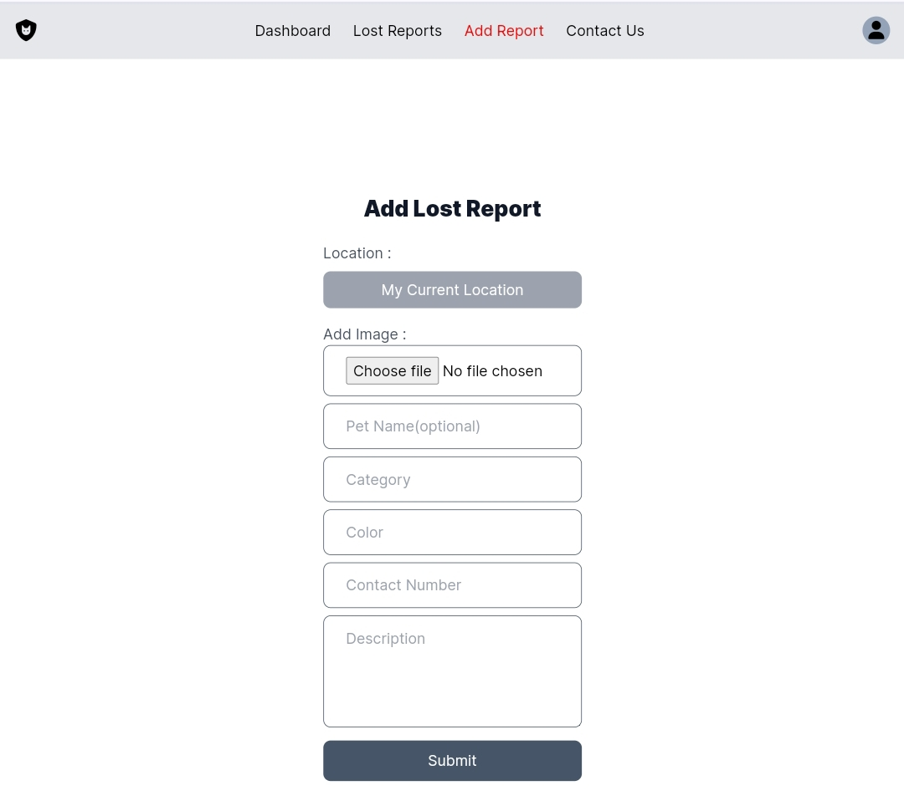

# LostPetGuardian

[](https://nodejs.org/)
[](https://developer.mozilla.org/en-US/docs/Web/JavaScript)
[](https://angular.io/)
[](https://tailwindcss.com/)
[](https://www.typescriptlang.org/)



LostPetGuardian is a user-friendly application built with Angular, Express, Tailwind CSS, and Google Maps integration. Users can easily report lost pets, and anyone can track these reports to help reunite lost pets with their owners.


## Installation

To get started, follow these steps:

1. Clone this repository to your local machine.

```bash
git clone https://github.com/haroonsaifi17/LostPetGuardian.git && cd LostPetGuardian
```

2. Install project dependencies using npm

```bash
npm install && npm run install
```

## Usage

To run the app, use the following command:

```bash
npm run dev
```

The client app will be accessible at [http://localhost:4200](http://localhost:4200).

The server will be accessible at [http://localhost:4020](http://localhost:4020).

### Blockchain Integration

In this project, we have implemented blockchain technology to enhance the security and immutability of lost pet reports. When a user submits a lost pet report, the system creates a unique transaction and appends it to the blockchain.

### Contribution:

Contributions are welcome! Feel free to submit pull requests or open issues for any suggestions, bug fixes, or improvements.

### License:

This project is licensed under the MIT License - see the [LICENSE](LICENSE) file for details.

